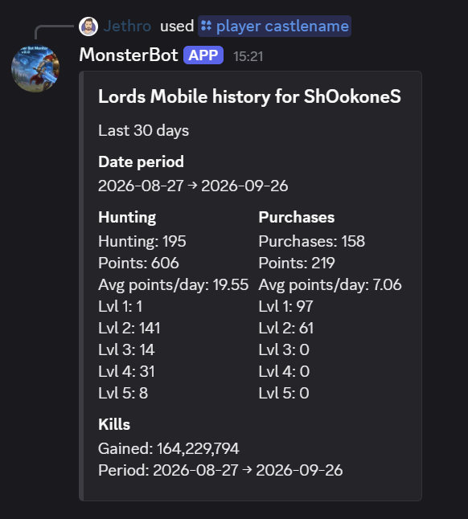
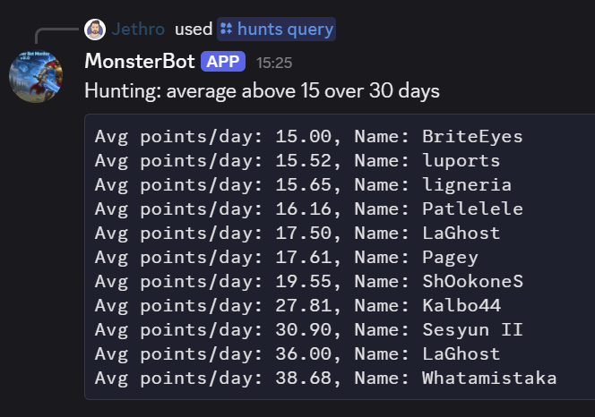
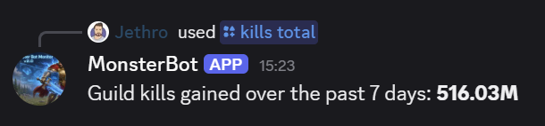

#  MonsterBot

MonsterBot turns your **LordsBot** exports into a **Discord bot** for your Lords Mobile guild. It is one program (`MonsterBot.exe`) that runs on the same Windows PC as LordsBot:

- It watches LordsBot's `stats\exported` folders and imports every new **GIFT_STATS** (hunts and purchases) and **GUILD_LIST** (might and kills) export.
- It answers **slash commands** in Discord: player history, hunt, purchase and kill leaderboards.
- It posts a **daily guild report** to a channel you choose: top hunters, players with zero hunts, and the most kills gained.
- It hides players who **left the guild** (missing from the exports for a few days) from leaderboards and searches.
- You configure it in a **local website** at <http://127.0.0.1:8080>. Only that PC can open it. The website can also import older exports and clean up the database.

Nothing is hosted in the cloud. The data stays in one file (`monsterbot.db`) next to the exe, and there are no ports to open and no database to install.

---

## Getting started

You need:

- A Windows PC that runs LordsBot and stays on.
- A Discord server where you have the **Manage Server** permission.
- About 10 minutes.

### Step 1: Create your Discord bot

Each guild runs its own bot, so your guild's data never leaves your PC.

1. Open the **Discord Developer Portal** at <https://discord.com/developers/applications> and log in.
2. Click **New Application** (top right). Name it, for example `MonsterBot` or `-R- Bot`, accept the terms and click **Create**.
3. On **General Information**:
   - *(Optional)* Upload an icon and add a description. Members will see these.
   - Make sure **Interactions Endpoint URL** is **empty**. A new application has it empty already. If you're reusing an application that ran an older bot, delete the URL and click **Save Changes**. Otherwise Discord sends every command to that URL instead of to MonsterBot, and commands fail with *"didn't respond in time"*.
4. Open the **Installation** tab. Set **Install Link** to **None** and click **Save Changes**.
   (Discord won't let you make the bot private in the next step while an install link is set.)
5. Open the **Bot** tab:
   1. *(Optional)* Set the bot's **username** and **icon**.
   2. Turn **Public Bot** **off**, so only you can add the bot to servers. Click **Save Changes**.
   3. Under **Privileged Gateway Intents**, leave all three switches **off**. MonsterBot doesn't need them.
   4. Click **Reset Token**, confirm (Discord may ask for your 2FA code), then click **Copy**.

> ⚠️ **The token is the bot's password.** Paste it only into MonsterBot. Never post it in Discord, a screenshot or a Git repository. If it leaks, click **Reset Token** again and paste the new one into MonsterBot.

You'll invite the bot to your server in Step 3. MonsterBot builds the invite link for you, with exactly the permissions it needs: *View Channels*, *Send Messages*, *Embed Links* and *Use Slash Commands*.

### Step 2: Install MonsterBot

1. Download `MonsterBot.exe` from the latest **[Release](../../releases/latest)**.
2. Create a folder for it, for example `C:\MonsterBot\`, and put the exe there. MonsterBot keeps its database, logs and backups **in the same folder**.
3. Double-click `MonsterBot.exe`.
   - Windows SmartScreen may warn you because the exe isn't code-signed. Click **More info → Run anyway**. You can check the download against the `MonsterBot.exe.sha256` file on the release page:
     `certutil -hashfile MonsterBot.exe SHA256`
   - A console window opens (this is MonsterBot running; closing it stops MonsterBot), and your browser opens <http://127.0.0.1:8080/setup>.

### Step 3: Connect the bot

On the **Setup** page:

1. Paste the **bot token** from Step 1.
2. Check the **LordsBot config folder** (default `C:\LordsBot\config`). LordsBot keeps one folder per castle in it, named after the castle's IGG ID, with the exports in `<IGG ID>\stats\exported`. Click **Browse…** to pick it in a Windows folder window. The page then lists the castles it found, for example *Found 2 castle(s): 123456789, 987654321*.
3. Click **Save**. After a few seconds, refresh: the status should say **Connected as YourBot#1234**.
   If it says *Discord rejected the token*, copy the token again (or reset it) and paste it once more.
4. Click **Invite bot to a server**, choose your Discord server and click **Authorize**.
5. Click **Turn on** next to **Start with Windows**, so MonsterBot starts whenever you log in.

The slash commands appear in your server within a minute. If they don't, restart Discord (Ctrl+R).

### Step 4: Link your castles to Discord

On the **Links** page:

1. **Castle IGG ID**: pick the castle from the list, or type its IGG ID. MonsterBot finds its `stats\exported` folder by itself. Once a castle's data has been imported, the list also shows its name.
2. **Guild name**: shown as the title of the daily report, for example `-R-`.
3. **Discord server and channel**: the channel the daily report is posted in. Pick "*import only, no posts*" if you only want the slash commands.
4. Tick **Post the daily report** and click **Add link**.

Within a minute MonsterBot imports every export already in that castle's folder (older files are imported quietly, without reports), then keeps checking for new ones every minute. Check the **Activity** page to see what was imported.

You can add as many links as you like: several castles or guilds, one castle to several channels, or several Discord servers.

### Step 5 (optional): Import older exports

Linked folders are imported in full automatically, so **every export already in a linked folder is picked up on first setup**. If you also kept older exports somewhere else (an archive folder, or a copy from another PC), import them from the **Data** page:

1. **Folder with exports**: the folder that holds the `.xlsx` files. Tick **Include sub-folders** to search below it too.
2. **Discord server the data belongs to**: the server whose commands should see this data.
3. Click **Import folder**. The **Activity** page shows each file as it's imported. Nothing is posted to Discord.

Only GIFT_STATS and GUILD_LIST exports are imported; other `.xlsx` files are skipped. Importing the same file twice is harmless, because rows are updated, not duplicated.

> Only the channels where the bot is allowed to send messages are listed. If your channel is missing, give the bot's role **View Channel** and **Send Messages** there, then refresh.

---

## Using the bot in Discord

| Command | What it does |
|---|---|
| `/player castlename <name> [days]` | A player's hunts, purchases (per level, points, average per day) and kills gained |
| `/player link <igg_id>` | Link your IGG ID to your Discord account |
| `/player discordname <member> [days]` | The same stats, by Discord member (they must have used `/player link`) |
| `/player search <part of name>` | Find players and their IGG IDs |
| `/hunts query <Above/Below> <value> [order] [days]` | Players whose average hunt points per day are above or below a value |
| `/purchases query <Above/Below> <value> [order] [days]` | The same, for purchase points |
| `/kills query <Above/Below> <value> [order] [days]` | Players whose kills gained are above or below a value |
| `/kills total [days]` | Total kills gained by the guild |

`days` defaults to 30 and can be up to 365.

### What it looks like

**`/player castlename`**: a player's hunting, purchases and kills over the last 30 days.



**`/hunts query`** with *Above*, value *15*, over *30* days: every player averaging more than 15 hunt points a day.



**`/kills total`** over the last *7* days: the guild's total kills gained.



**Players who left the guild.** A player missing from the exports for more than **3 days** (change this on the **Setup** page, 0 = never hide) is left out of `/hunts`, `/purchases`, `/kills` and `/player search`. The days are counted back from the newest export, not from today, so a pause in imports doesn't hide everyone. `/player castlename` still finds them, marked "no longer in the guild exports", so you can look up their history.

**Daily report.** When a new export arrives, MonsterBot posts:

- **GIFT_STATS:** the top 5 hunters of the day, and every member with zero hunts.
- **GUILD_LIST:** the top 5 kills gained since LordsBot's previous export.

---

## Everyday running

| Task | How |
|---|---|
| Open the settings | <http://127.0.0.1:8080> on the LordsBot PC |
| Stop MonsterBot | Close its console window |
| Update MonsterBot | Close it, replace `MonsterBot.exe` with the new release, start it again. Your data and settings are kept. |
| Change the bot token | Paste the new token on **Setup** and click **Save** |
| Re-import a file | **Activity** page → **Re-import** |
| See what's stored | **Data** page: players, rows and date range per server |
| Delete old stats | **Data** page → **Delete old data** (for example, older than 365 days). Type `DELETE` to confirm. |
| Start over | **Data** page → **Delete all data**, with "Import the files in linked folders again" ticked. Settings, links and linked IGG IDs are kept. |
| Logs | `logs\monsterbot.log` next to the exe |
| Backups | `backups\monsterbot-YYYY-MM-DD.db`, one per day, the last 14 kept. Copy the folder somewhere else now and then. |
| Undo a clean-up | Every delete on the Data page first saves `backupsefore-cleanup-<date-time>.db`. Restore it like any backup (next row). |
| Restore a backup | Close MonsterBot, delete `monsterbot.db-wal` and `monsterbot.db-shm`, copy the backup over `monsterbot.db`, start MonsterBot |
| Move to another PC | Copy the whole MonsterBot folder |

### Troubleshooting

| Problem | Fix |
|---|---|
| Browser says the page can't be reached | MonsterBot isn't running. Start `MonsterBot.exe`. |
| "Port 8080 is in use" in the log | MonsterBot is already running (check the taskbar), or another program uses port 8080. Set the `MONSTERBOT_PORT` environment variable to another port. |
| Slash commands don't show up | Wait a minute and restart Discord (Ctrl+R). Check that the bot was invited with the link from the Setup page. |
| Commands say *"didn't respond in time"* or *"The application did not respond"* | In the Developer Portal → **General Information**, clear **Interactions Endpoint URL** and click **Save Changes**. If it is already empty, check that MonsterBot is running and the Setup page says **Connected**, then look in `logs\monsterbot.log`. |
| No daily report | On **Links**, check the link is *Enabled* with *Daily report: yes*. Reports are only posted for exports from the last 2 days. Check the bot can post in the channel, and check the **Activity** page for errors. |
| A file shows an error on Activity | Usually the file was still open or being written. Click **Re-import**. |

---

## Development

Requires Python 3.12 on Windows.

```powershell
py -3.12 -m venv .venv
.venv\Scripts\activate
pip install -r requirements-dev.txt

pytest --cov=monsterbot --cov=tools          # tests (CI requires 80% coverage)
python run.py                                # run from source: data goes in the current folder
```

| Environment variable | Default | Purpose |
|---|---|---|
| `MONSTERBOT_HOME` | folder of the exe (or the current folder from source) | Where `monsterbot.db`, `logs\` and `backups\` go |
| `MONSTERBOT_PORT` | `8080` | Port for the admin website (always bound to 127.0.0.1) |

Use a **separate test bot** and test server during development, not your guild's real bot.

### Project layout

```
monsterbot/
  main.py        entry point: starts the website, bot, importer and backups on one asyncio loop
  web.py         admin website (aiohttp, server-rendered HTML, localhost only): Setup, Links, Activity
  data_page.py   admin website Data page: folder import and clean-up
  bot.py         discord.py client, slash commands, daily report
  importer.py    finds and parses LordsBot xlsx exports (type detected from the header row)
  db.py          SQLite schema, migrations (PRAGMA user_version) and queries
  autostart.py   "Start with Windows" (HKCU Run key)
tools/migrate_from_mongo.py   one-off import from the old MongoDB
tests/                        pytest suite; tests/samples holds real LordsBot exports with player names and IDs anonymized
```

### Building and releasing

```powershell
pyinstaller --onefile --name MonsterBot --icon assets/monsterbot.ico run.py     # local build -> dist\MonsterBot.exe
```

Releases are built by GitHub Actions (`.github/workflows/release.yml`). Push a version tag and the workflow runs the tests, builds `MonsterBot.exe` with that version, and publishes a GitHub Release with the exe and its SHA-256 checksum:

```powershell
git tag v0.1.0
git push origin v0.1.0
```

`.github/workflows/ci.yml` runs the tests on every push to `main` and on every pull request.
